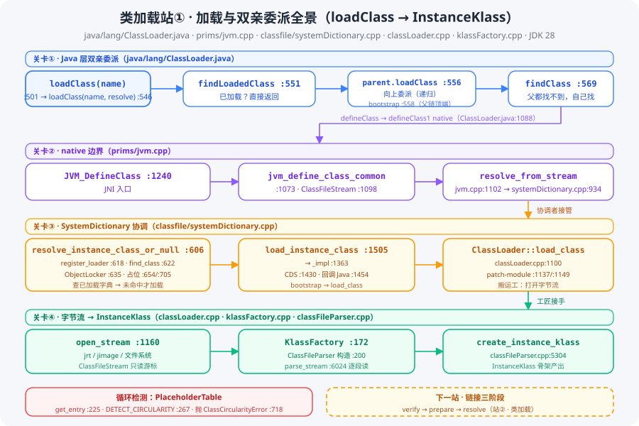

# 类加载系列 · 第一站：加载与双亲委派——「把人造出来」的第一段路

> 版本：JDK 28 主线（`D:/project/jdk`，`28-internal`）
> 系列：类加载源码跟读 · 第 01 篇（[回到系列索引](README.md)）
> 核心文件：`src/java.base/share/classes/java/lang/ClassLoader.java`（+ `src/hotspot/share/prims/jvm.cpp` · `classfile/systemDictionary.cpp` · `classfile/classLoader.cpp` · `classfile/klassFactory.cpp` · `classfile/placeholders.cpp`）

---

## 快速概览

- **一句话结论**：常量池站②的慢路径说「没加载就去加载」——加载的第一段路是 **Java 层的双亲委派**（`ClassLoader.loadClass`，ClassLoader.java:546）：先问 `findLoadedClass` 查已加载、再向上委派 `parent.loadClass` / `findBootstrapClassOrNull`、兜底才 `findClass` 自己找字节流。找到 `.class` 字节后跨过 native 边界（`JVM_DefineClass` jvm.cpp:1240），由 HotSpot 的 `SystemDictionary::resolve_from_stream`（systemDictionary.cpp:934）协调，最终 `KlassFactory::create_from_stream`（klassFactory.cpp:172）交给 `ClassFileParser` 产出 `InstanceKlass`。
- **双亲委派的本质**：**从下往上问、从上往下找**——子加载器不先自己找，而是把请求一层层抛给父加载器；父加载器都找不到才轮到子加载器自己找。核心保证：**同一个类在 JVM 里只有一个定义者**（全限定名 + 定义加载器 = 唯一）。
- **HotSpot 侧的两级分工**：`SystemDictionary` 是「协调者」——查已加载、占并发位、防循环；`ClassLoader::load_class` 是「搬运工」——打开 jrt/jimage/文件系统字节流；`KlassFactory` + `ClassFileParser` 是「工匠」——把字节流解析成 `InstanceKlass`。
- **循环检测**：加载 A 时发现依赖 B，B 又依赖 A——`PlaceholderTable`（placeholders.cpp）通过 `DETECT_CIRCULARITY` 占位令牌（:267-268）识别，抛 `ClassCircularityError`（:718）。
- **与后续衔接**：`create_instance_klass` 产出的是「骨架」——字段/方法/常量池已就位，但还没做完链接（verify/prepare/resolve）和初始化（clinit）。那是**站②（链接三阶段）和站③（初始化与卸载）**的事。

---

## 一、全景：从 loadClass 到 InstanceKlass 的完整链路



```
调用方 Class.forName / new / 常量池 resolve_or_fail
   │
   ▼
ClassLoader.loadClass(String)                 ClassLoader.java:501
   └─► loadClass(String, boolean)             ClassLoader.java:546
         ├─ synchronized 加锁                 :549
         ├─ findLoadedClass(name)             :551（已加载？直接返回）
         ├─ parent != null
         │    └─ parent.loadClass(name, false):556（向上委派）
         ├─ findBootstrapClassOrNull(name)    :558（委派给启动类加载器）
         └─ findClass(name)                   :569（父都找不到，自己找）
               └─ defineClass → defineClass1  :974 / native 声明 :1088
   │
   ▼  native 边界
JVM_DefineClass                               jvm.cpp:1240
   └─► jvm_define_class_common                jvm.cpp:1073
         └─ SystemDictionary::resolve_from_stream   jvm.cpp:1102 → systemDictionary.cpp:934
               └─► resolve_instance_class_or_null   systemDictionary.cpp:606（协调者）
                     ├─ register_loader :618 · find_class :622 · ObjectLocker :635
                     ├─ PlaceholderTable::get_entry :654（并发占位）
                     ├─ find_and_add(LOAD_INSTANCE) :705（防循环令牌）
                     └─ load_instance_class :1505 → load_instance_class_impl :1363
                           ├─ CDS 检查 :1430-1440
                           ├─ ClassLoader::load_class（classLoader.cpp:1100）
                           │     ├─ open_stream（jrt/jimage）:1160
                           │     └─ KlassFactory::create_from_stream（klassFactory.cpp:172）
                           │           └─ ClassFileParser（:200）→ create_instance_klass（:208，定义 classFileParser.cpp:5304）
                           └─ 应用类：回调 Java ClassLoader.loadClass :1454-1478
```

**两句话记忆**：**「先问后找、向上委派」**是 Java 层策略；**「协调占位、字节流解析」**是 HotSpot 层落地。

## 二、Java 层：双亲委派模型（ClassLoader.java:546）

```java
protected Class<?> loadClass(String name, boolean resolve)  // :546
    throws ClassNotFoundException
{
    synchronized (getClassLoadingLock(name)) {              // :549 每个类名一把锁
        Class<?> c = findLoadedClass(name);                 // :551 已加载？直接返回
        if (c == null) {
            try {
                if (parent != null) {
                    c = parent.loadClass(name, false);      // :556 向上委派（递归）
                } else {
                    c = findBootstrapClassOrNull(name);     // :558 委派给启动类加载器
                }
            } catch (ClassNotFoundException e) {
            }
            if (c == null) {
                c = findClass(name);                        // :569 父都找不到，自己找
            }
        }
        if (resolve) resolveClass(c);                       // 站②（链接）的入口
        return c;
    }
}
```

### 2.1 委派方向与「唯一性」保证

- **方向**：`loadClass` 先在**自己的** `findLoadedClass`（:551，native `findLoadedClass0` :1270）查是否已加载——已加载直接返回；没加载**向上**委派父加载器（:556）；父链顶端是启动类加载器（bootstrap，`findBootstrapClassOrNull` :558，定义 :1241）。
- **兜底**：父链全部找不到，`findClass`（:569，定义 :684）才自己动手——默认抛 `ClassNotFoundException`，子类（URLClassLoader 等）重写它去读 jar/目录。
- **唯一性**：JVM 中「全限定名 + 定义加载器」唯一对应一个类——这正是双亲委派的结果：同一个类名最多被最上层那个加载器定义一次，下层只是「借用」上层的成果。

### 2.2 从 Java 层跨到 native

`defineClass`（:974 调用 `defineClass1`）把字节数组交给 native：

```java
static native Class<?> defineClass1(ClassLoader loader, String name, byte[] b,  // :1088
                                    int off, int len, ProtectionDomain pd, String source);
static native Class<?> defineClass2(ClassLoader loader, String name, java.nio.ByteBuffer b, ...); // :1093
static native Class<?> defineClass0(ClassLoader loader, ...);                                     // :1111
```

JDK 28 的 native 声明直接留在 `ClassLoader.java`（已无独立的 `JVM.java` 源文件）。**注意**：这条链路是「应用类/自定义类」的路径；bootstrap 类（`Object` 等）由 HotSpot 直接 `ClassLoader::load_class` 从 jrt 读，不经过 Java `loadClass` 回调（见第四节）。

## 三、native 边界：JVM_DefineClass → jvm_define_class_common（jvm.cpp:1240 / :1073）

```cpp
JVM_ENTRY(jclass, JVM_DefineClass(JNIEnv *env, const char *name, jobject loader,
                                  const jbyte *buf, jsize len, jobject pd))
  return jvm_define_class_common(name, loader, buf, len, pd, nullptr, THREAD);  // :1241
JVM_END

static jclass jvm_define_class_common(const char *name, ...) {                  // :1073
  ClassFileStream st((u1*)buf, len, nullptr);              // :1098 字节流视图
  Klass* k = SystemDictionary::resolve_from_stream(&st, class_name,             // :1102
                                                   class_loader, ...);
}
```

- `ClassFileStream`（:1098）只是 .class 字节的「只读游标」，不拷贝；
- `SystemDictionary::resolve_from_stream`（jvm.cpp:1102 → 定义 systemDictionary.cpp:934）是 HotSpot 侧加载的**总入口**——从这里开始，协调者接管。

## 四、SystemDictionary：协调者（systemDictionary.cpp:606）

### 4.1 resolve_instance_class_or_null 主流程

```cpp
InstanceKlass* SystemDictionary::resolve_instance_class_or_null(Symbol* name,
                                                                Handle class_loader, TRAPS) {  // :606
  ClassLoaderData* loader_data = register_loader(class_loader);   // :618 加载器登记
  // :622 find_class：先查「已加载字典」——命中直接返回（快路径）
  // :635 ObjectLocker：对「类名+加载器」加锁（get_loader_lock_or_null）
  // :654 PlaceholderTable::get_entry：查并发占位（正在加载中？）
  // :665 handle_parallel_super_load：并行父类加载处理
  // :705 find_and_add(LOAD_INSTANCE)：登记「正在加载」占位令牌
  // :728 loaded_class = load_instance_class(name, class_loader, THREAD);
  // :736 find_and_remove：加载结束移除占位
}
```

**三种查找状态**（协调者的核心数据结构）：

| 结构 | 作用 | 行号 |
|---|---|---|
| SystemDictionary（已加载字典） | 加载**完成**的类 → 直接返回 | :622 |
| PlaceholderTable（占位表） | 正在加载中的类 → 防并发重复加载 | :654 / :705 |
| loader_data（加载器登记） | 类加载器 → 类字典/类路径的映射 | :618 |

### 4.2 load_instance_class 与 load_instance_class_impl（:1505 / :1363）

```cpp
InstanceKlass* SystemDictionary::load_instance_class(Symbol* name,
                                                     Handle class_loader, TRAPS) {  // :1505
  return load_instance_class_impl(name, class_loader, CHECK_NULL);                 // :1509
}

InstanceKlass* SystemDictionary::load_instance_class_impl(Symbol* class_name,
                                                          Handle class_loader, TRAPS) {  // :1363
  // :1430-1440 CDS：共享归档里已有？直接取（AppCDS 加速路径）
  // :1445 ClassLoader::load_class：bootstrap 类由 HotSpot 直接读 jrt
  // :1454-1478 应用类：回调 Java ClassLoader.loadClass（与 Java 层形成闭环）
}
```

- **bootstrap 类**（`class_loader` 为空）：走 `ClassLoader::load_class`（:1445）——HotSpot 自己从 jrt/jimage 打开字节流；
- **应用类**：回调 Java 层的 `ClassLoader.loadClass`（:1454-1478）——**注意这里 Java 层会再次执行双亲委派**，最终 `defineClass` 又回到 native，形成「Java → native → Java → native」的往返；真正读字节流的还是 native 侧（第三节的 `jvm_define_class_common`）。

## 五、ClassLoader::load_class：搬运工（classLoader.cpp:1100）

```cpp
InstanceKlass* ClassLoader::load_class(Symbol* name, PackageEntry* pkg_entry,
                                       bool search_append_only, TRAPS) {           // :1100
  // :1137 / :1149 patch-module 支持（--patch-module 替换类文件）
  // :1160 jrt：stream = _jrt_entry->open_stream(THREAD, file_name);   bootstrap 主路径
  // :1179 文件系统/zip：stream = e->open_stream(THREAD, file_name);
  // :1196 KlassFactory::create_from_stream(stream, ...) → 工匠接手
}
```

`open_stream` 按来源分派：jrt/jimage（:453，JDK 模块镜像）、目录（:320）、zip/jar（:421）——拿到的是 `ClassFileStream`（只读游标），统一交给下一站。

## 六、KlassFactory + ClassFileParser：工匠（klassFactory.cpp:172 / classFileParser.cpp:5304）

```cpp
InstanceKlass* KlassFactory::create_from_stream(ClassFileStream* stream, ...) {   // klassFactory.cpp:172
  ClassFileParser parser(stream, ...);       // :200 构造解析器（含校验参数）
  InstanceKlass* result = parser.create_instance_klass(old_stream != stream, ...);  // :208
}

InstanceKlass* ClassFileParser::create_instance_klass(...) {  // 定义在 classFileParser.cpp:5304
  // 内部：parse_stream（classFileParser.cpp:6024）读类文件各段
  //       post_process（:6281）收尾（挂常量池、排 vtable 等）
}
```

- `ClassFileParser` 构造（classFileParser.cpp:5826）只做参数校验与准备；真正逐段读 .class 是 `parse_stream`（:6024）——字段/方法/常量池全在这里（**常量池系列站①就是它的一部分**）；
- `post_process`（:6281）做收尾：`set_pool_holder` / `set_constants` 挂载（呼应常量池站①第五节）、vtable 初始化等——**这是链接（站②）之前的最后一步**。

## 七、循环检测：PlaceholderTable（placeholders.cpp）

加载 A 的过程中触发加载 B，B 的父类又是 A——形成循环：

```cpp
// placeholders.cpp
PlaceholderEntry* PlaceholderTable::get_entry(Symbol* name, ClassLoaderData* loader_data) { // :225
  ...
  entry->find_and_add(..., DETECT_CIRCULARITY);   // :255 / :267-268 登记防循环令牌
  ...
  // :655 circularity_detection_in_progress：发现同线程已有该类占位 → 循环！
  // :718 抛 ClassCircularityError
}
```

**机制**：`PlaceholderTable` 的占位条目记着「谁（线程）正在加载哪个类」。`load_instance_class` 前先 `find_and_add(LOAD_INSTANCE)`（systemDictionary.cpp:705）占位；若在解析过程中再次遇到同一线程加载同一类（如父类链成环），`circularity_detection_in_progress` 命中 → 抛 `ClassCircularityError`。占位令牌同时保证**并发下同一类只被一个线程真正加载**。

## 八、与站②/站③的衔接

`create_instance_klass` 产出的是「骨架」：`InstanceKlass` 对象已存在、字段/方法/常量池已就位，但：

- **链接三阶段（站②）**：`verify`（字节码校验）→ `prepare`（静态字段分配默认值）→ `resolve`（符号引用解析，`LinkResolver` 干活，与常量池站②呼应）；
- **初始化与卸载（站③）**：`<clinit>` 静态初始化（`initialize` 流程、`_init_state` 状态机）+ 类卸载（GC 卸载类、卸载条件）。

**一句话衔接**：本站回答了「类从哪来」（加载+双亲委派），站②回答「类怎么验收」（链接三阶段），站③回答「类什么时候干活、什么时候走」（初始化+卸载）。

---

## 行号速查

| 位置 | 行号 |
|---|---|
| loadClass(String) / loadClass(String,boolean) | ClassLoader.java:501 / :546（加锁 :549） |
| findLoadedClass 调用 / parent.loadClass / findBootstrapClassOrNull / findClass | :551 / :556 / :558 / :569 |
| findClass 定义 / findLoadedClass 定义 / findBootstrapClassOrNull 定义 | :684 / :1264 / :1241 |
| defineClass1 / defineClass2 / defineClass0（native 声明） | :1088 / :1093 / :1111 |
| findLoadedClass0（native 声明） | :1270 |
| JVM_DefineClass / jvm_define_class_common / ClassFileStream / resolve_from_stream 调用 | jvm.cpp:1240 / :1073 / :1098 / :1102 |
| resolve_from_stream 定义 / resolve_instance_class_or_null | systemDictionary.cpp:934 / :606 |
| register_loader / find_class / ObjectLocker / get_loader_lock_or_null | :618 / :622 / :635 / :634 |
| PlaceholderTable::get_entry / find_and_add(LOAD_INSTANCE) / load_instance_class / find_and_remove | :654 / :705 / :728 / :736 |
| load_instance_class / load_instance_class_impl | :1505 / :1363（CDS :1430-1440 · 回调 :1454-1478 · load_class :1445） |
| ClassLoader::load_class / open_stream（jrt / 目录 / zip） | classLoader.cpp:1100 / :1160（:453 / :320 / :421） |
| KlassFactory::create_from_stream / ClassFileParser 构造 / create_instance_klass 调用 | klassFactory.cpp:172 / :200 / :208（定义 classFileParser.cpp:5304） |
| parse_stream / post_process | classFileParser.cpp:6024 / :6281 |
| 循环检测 get_entry / find_and_add / DETECT_CIRCULARITY / 抛错 | placeholders.cpp:225 / :255 / :267-268 / :718 |
