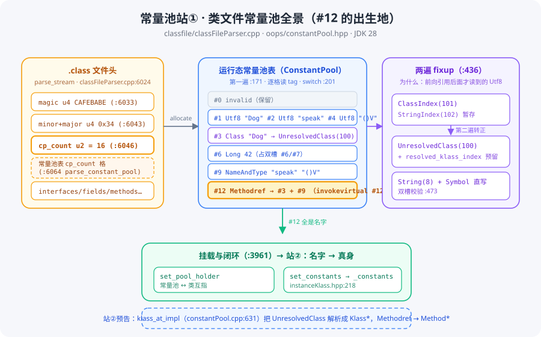

# 常量池系列 · 第一站：类文件常量池——#12 在 .class 里长什么样

> 版本：JDK 28 主线（`D:/project/jdk`，`28-internal`）
> 系列：常量池源码跟读 · 第 01 篇（[回到系列索引](README.md)）
> 核心文件：`src/hotspot/share/classfile/classFileParser.cpp`（+ `oops/constantPool.hpp` · `classfile/symbolTable.cpp` · `classfile/classfile_constants.h.template`）

---

## 快速概览

- **一句话结论**：`invokevirtual #12` 里的 `#12` 是一个 **cp index**——指向该类常量池表的第 12 格；那一格存的是一个 `CONSTANT_Methodref` 项，通过双指针（`class_index` + `name_and_type_index`）最终指向两个 `CONSTANT_Utf8`（类名 `Dog`、方法名+签名 `speak:()V`）。**常量池只存名字和字面量，不存"人"**。
- **两遍解析是本站核心认知**：第一遍（`parse_constant_pool_entries` :171）顺序读表、按 tag 分发，Utf8 进 SymbolTable 全局去重；Class/String 因可能**前向引用**后面才读到的 Utf8，第一遍只能暂存索引（内部 tag `ClassIndex=101` / `StringIndex=102`）；第二遍（:436）等所有 Utf8 就绪后再转正（`UnresolvedClass=100` / `String`）。
- **结构要点**：常量池长度 ≠ 项数量——`CONSTANT_Long` / `CONSTANT_Double` 占两个槽位（:312/:324 跳过下一格，第二遍校验 :473）。
- **与后续衔接**：本站结束时常量池已挂到 `InstanceKlass._constants`（instanceKlass.hpp:218），但所有类项仍是"未解析"状态——把 `UnresolvedClass` 变成 `Klass*`、把 Methodref 变成 `Method*` 是**站②（运行时常量池与解析）**的事。

---

## 一、全景：常量池在类文件里的坐标



.class 文件头是固定布局（`parse_stream`，classFileParser.cpp:6024）：

| 字段 | 大小 | 行号 | 说明 |
|---|---|---|---|
| `magic` | u4 | :6033 | 固定 `CAFEBABE` |
| `minor/major` | u4 | :6043 | 版本号，决定 `verify_class_version` |
| `cp_count` | u2 | :6046 | **常量池总格数**（含 0 号保留槽） |
| 常量池表 | 变长 | :6064 | `cp_count` 格，每格 `tag` + 内容 |
| interfaces/fields/methods/attributes | 变长 | :6191-6231 | 类其余结构 |

读 `cp_count` 后**一次性分配整张表**：`ConstantPool::allocate`（:6058 → constantPool.cpp:78），之后任何 `#index` 都是这张表的数组下标。

## 二、第一遍：逐格读 tag（:171）

`parse_constant_pool_entries`（classFileParser.cpp:171）的核心循环：

```cpp
for (int index = 1; index < length; index++) {   // :196，跳过 0 号保留槽
  const u1 tag = cfs->get_u1_fast();             // :200，每格第一个字节
  switch (tag) {                                 // :201，按 tag 分发
    case JVM_CONSTANT_Class:  ...                // :202
    case JVM_CONSTANT_Fieldref: ...              // :208
    ...
  }
}
```

外部 tag 定义（classfile_constants.h.template:97-116）：

| tag | 常量项 | 行号 | 结构 | 第一遍动作 |
|---|---|---|---|---|
| 1 | `Utf8` | :334 | 字符串 | **进 SymbolTable 去重**（见第三节） |
| 3/4 | `Integer`/`Float` | :291/:297 | u4 值 | `int_at_put` / `float_at_put` 直存 |
| 5/6 | `Long`/`Double` | :303/:315 | u8 值 | 直存 + `index++` **占双槽**（:312/:324） |
| 7 | `Class` | :202 | name_index | 暂存索引 → 内部 `ClassIndex`(101) |
| 8 | `String` | :229 | string_index | 暂存索引 → 内部 `StringIndex`(102) |
| 9 | `Fieldref` | :208 | class_index + nat_index | `field_at_put` |
| 10 | `Methodref` | :215 | class_index + nat_index | `method_at_put`（**#12 就是它**） |
| 11 | `InterfaceMethodref` | :222 | class_index + nat_index | `interface_method_at_put` |
| 12 | `NameAndType` | :327 | name_index + descriptor_index | `name_and_type_at_put` |
| 15 | `MethodHandle` | :235 | kind + ref_index | 记索引，等 BootstrapMethods |
| 16 | `MethodType` | :249 | descriptor_index | 记索引 |
| 17 | `Dynamic` | :259 | bsm + nat | 记索引 |
| 18 | `InvokeDynamic` | :275 | bsm + nat | 记索引 |
| 19/20 | `Module`/`Package` | :372 | 限 module-info | 普通类出现 = 坏文件 |
| 其他 | — | :384 | — | `classfile_parse_error`（未知即拒绝） |

**双指针项链**（以 `invokevirtual #12` 为例）：

```
#12 Methodref ──class_index──► #3  Class "Dog" ──name_index──► #1 Utf8 "Dog"
     │
     └──name_and_type_index──► #9  NameAndType "speak" "()V"
                                   ├─ name_index      ──► #2 Utf8 "speak"
                                   └─ descriptor_index──► #4 Utf8 "()V"
```

签名（descriptor）独立成格，是**重载区分**的根基：`speak()` 与 `speak(I)V` 的 name 相同、descriptor 不同。

## 三、CONSTANT_Utf8 与 SymbolTable 全局去重（:334）

字符串是类名/方法名/签名的原材料，一个 JVM 里 "speak" 可能被几千个类引用——所以 **Symbol 全局只存一份**：

```cpp
Symbol* result = SymbolTable::lookup_only(utf8_buffer, utf8_length, hash); // :349 只查不加
if (result == nullptr) {
  // 头一回：攒进批量数组（:352-366），最后 new_symbols 一次插入（:358 → symbolTable.cpp:485）
} else {
  cp->symbol_at_put(index, result);                                        // :368 直接复用
}
```

- `lookup_only`：symbolTable.cpp:446，`hash_symbol` + `lookup_common`，**不插入**；
- `new_symbols`：symbolTable.cpp:485，逐个 `do_add_if_needed`（:503）真正去重入表；
- 效果：类之间**共用同一 `Symbol` 对象**，Symbol 表是 JVM 级全局结构。

## 四、为什么 Class/String 要两遍 fixup

第一遍是**顺序读**：第 1 格的 `Class` 可能引用第 20 格的 `Utf8`——第一遍时第 20 格还没读，因此只能：

1. 第一遍：`Class`/`String` 暂存索引（内部 tag `ClassIndex=101` / `StringIndex=102`，constantTag.hpp:39-48）；
2. 所有 Utf8 就绪后第二遍转正。

内部 tag 是 **HotSpot 私有**、不出现在 .class 文件：

| 内部 tag | 值 | 含义 |
|---|---|---|
| `Invalid` | 0 | 保留槽 / Long-Double 第二槽 |
| `UnresolvedClass` | 100 | 类项定稿态：有名字、未加载 |
| `ClassIndex` | 101 | 第一遍暂存态：只有 name_index |
| `StringIndex` | 102 | 第一遍暂存态：只有 string_index |
| `UnresolvedClassInError` | 103 | 解析失败记录（防重复报错） |

## 五、第二遍 fixup：转正 + 槽位预留（:436）

```cpp
for (int index = 1; index < length; index++) {          // :436
  case JVM_CONSTANT_ClassIndex:                          // :501
    cp->unresolved_klass_at_put(index, class_index, num_klasses++);  // :507 → tag=100，预留解析槽
  case JVM_CONSTANT_StringIndex:                         // :510
    cp->unresolved_string_at_put(index, sym);            // :516 → tag=String，写 Utf8 Symbol
  // :473-480 校验：Long/Double 的第二槽必须仍为 Invalid
}
```

- `unresolved_klass_at_put` 额外分配 `resolved_klass_index`——**给将来解析成真 Klass 预留的槽位号**，指向 `_resolved_klasses` 数组（constantPool.hpp:97）；
- 转正后每个类项处于"**名字确定、槽位明确、类本体未加载**"状态——表对运行时完全可寻址。

## 六、挂载与闭环（:3961）

```cpp
_cp->set_pool_holder(this_klass);      // :3961 常量池记住所属类
this_klass->set_constants(_cp);        // :3962 类记住自己的常量池（instanceKlass.hpp:218 _constants）
```

**双向指针各取所需**：解析时靠 `pool_holder` 查类加载器/访问权限；字节码执行时靠 `_constants` O(1) 取表。

**回头看 #12**：`invokevirtual #12` → 第 12 格 `Methodref` → 「Dog」+「speak()V」——**全是名字**。名字变成 `Method*` 真身，是站②（运行时常量池解析，`klass_at_impl` constantPool.cpp:631）的活；"按接收者实际类型选真正执行谁"则是 method-call 系列 runtime 分派（linkResolver.cpp:1412）的活。

---

## 行号速查

| 位置 | 行号 |
|---|---|
| 读 cp_count / 分配表 | classFileParser.cpp:6046 / :6058（constantPool.cpp:78） |
| 第一遍循环 / 读 tag / switch | :196 / :200 / :201 |
| Class / Fieldref / Methodref / InterfaceMethodref | :202 / :208 / :215 / :222 |
| String / MethodHandle / MethodType / Dynamic / InvokeDynamic | :229 / :235 / :249 / :259 / :275 |
| Integer / Float / Long / Double（+跳槽） | :291 / :297 / :303(:312) / :315(:324) |
| NameAndType / Utf8 | :327 / :334 |
| Utf8 查重 / 批量插入 | :349 / :358（symbolTable.cpp:446 / :485） |
| Module/Package 边界 / default 报错 | :372 / :384 |
| 第二遍循环 / fixup① / fixup② / 双槽校验 | :436 / :501-508 / :510-517 / :473-480 |
| 挂载互指 | :3961-3962（instanceKlass.hpp:218） |
| 外部 tag / 内部 tag | classfile_constants.h.template:97-116 / constantTag.hpp:39-48 |
