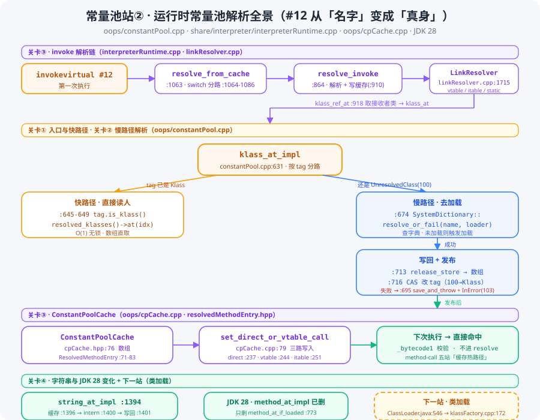

# 常量池系列 · 第二站：运行时常量池与解析——#12 从「名字」变成「真身」

> 版本：JDK 28 主线（`D:/project/jdk`，`28-internal`）
> 系列：常量池源码跟读 · 第 02 篇（[回到系列索引](README.md)）
> 核心文件：`src/hotspot/share/oops/constantPool.cpp`（+ `oops/constantPool.hpp` · `oops/cpCache.cpp` · `oops/resolvedMethodEntry.hpp` · `share/interpreter/interpreterRuntime.cpp` · `share/interpreter/linkResolver.cpp`）

---

## 快速概览

- **一句话结论**：站①结束时常量池 = 一张**名录簿**，#12 只写着「Dog.speak()V」（名字）。本站做一件事——**按名字找到真正的人**：找到 Dog 类的 `Klass*`、找到 speak 方法的 `Method*`，并把「人」写回缓存（`_resolved_klasses` / `ConstantPoolCache`）。**解析只发生一次，之后就「直接读人、不再翻名字」**。
- **类解析的双路径**：所有「按 #index 找类」的操作都汇到 `klass_at_impl`（constantPool.cpp:631）——tag 已是 `Klass` 走**快路径**（:645-649，从 `resolved_klasses()` 数组 O(1) 直取）；还是 `UnresolvedClass`(100) 走**慢路径**（:674，`SystemDictionary::resolve_or_fail` 查字典或触发加载，成功后 `release_store` 写回 :713 + CAS 改 tag :716）。
- **方法解析与缓存**：invoke 第一次执行走 `resolve_from_cache`（interpreterRuntime.cpp:1063）→ `resolve_invoke`（:864）→ `LinkResolver::resolve_invoke`（linkResolver.cpp:1715，按字节码语义分路 vtable/itable/static/special）→ 结果写进 `ConstantPoolCache`（`set_direct_or_vtable_call`，cpCache.cpp:79）。方法解析**天然复用**类解析（`klass_ref_at` constantPool.cpp:918 → `klass_at_impl`）。
- **JDK 28 变化**：`method_at_impl` 已移除，只剩只查不解析的 `method_at_if_loaded`（constantPool.cpp:773）——方法解析与 invoke 指令绑定、收敛进 ConstantPoolCache。
- **与后续衔接**：慢路径说「没加载就去加载」——「把人造出来」的完整链路是**类加载系列**（`ClassLoader.loadClass` ClassLoader.java:546 → `JVM_DefineClass` jvm.cpp:1240 → `resolve_from_stream` systemDictionary.cpp:934 → `KlassFactory::create_from_stream` klassFactory.cpp:172）的事，两个系列在 `resolve_or_fail` 处握手。

---

## 一、全景：运行时常量池解析全链路



`invokevirtual #12` 第一次执行时，完整链路（agent 实测行号）：

```
invokevirtual #12（第一次执行）
   │
   ▼
InterpreterRuntime::resolve_from_cache   interpreterRuntime.cpp:1063
   │ switch(bytecode) 分路 :1064-1086（invoke* 全部汇入）
   ▼
InterpreterRuntime::resolve_invoke       interpreterRuntime.cpp:864
   ├─ LinkResolver::resolve_invoke       linkResolver.cpp:1715（按语义分路）
   │     └─ pool->klass_ref_at           constantPool.cpp:918（取接收者类）
   │           └─ klass_at → klass_at_impl   constantPool.cpp:631
   │                 ├ 快路径 :645-649（resolved_klasses()->at）
   │                 └ 慢路径 :674（SystemDictionary::resolve_or_fail）
   │                        ├ 写回 _resolved_klasses :713（release_store）
   │                        └ CAS 改 tag :716（UnresolvedClass → Klass）
   └─ update_invoke_cp_cache_entry       interpreterRuntime.cpp:910
         └─ set_direct_or_vtable_call    cpCache.cpp:79（写 ConstantPoolCache）
```

**两条缓存的职责分工**：`_resolved_klasses` 缓存**类**（名字→Klass*），`ConstantPoolCache` 缓存**方法调用**（invoke 指令→Method*+分派方式）。类解析服务所有引用该类的指令，方法解析服务每一条 invoke 指令。

## 二、关卡① 入口与快路径：klass_at_impl（:631）

`ConstantPool::klass_at_impl` 是运行期类解析的**总入口**：字节码里的类引用（`ldc`、`new`、`checkcast`、invoke 的 class_index 等）最终都汇到这里，按 tag 决定走哪条路：

```cpp
// constantPool.cpp:631
Klass* ConstantPool::klass_at_impl(const constantPoolHandle& this_cp, int which, TRAPS) {
  // :645-649 快路径：tag 已是 Klass → 从数组直取
  if (tag.is_klass()) {
    Klass* k = this_cp->resolved_klasses()->at(klass_slot.resolved_klass_index());
    return k;
  }
  // :674 慢路径：SystemDictionary::resolve_or_fail（见第三节）
}
```

- **快路径**（:645-649）：`tag.is_klass()` 为真 → `resolved_klasses()->at(resolved_klass_index)` 直取。这个 `_resolved_klasses` 数组（constantPool.hpp:97）就是站①第二遍 fixup 时 `unresolved_klass_at_put`（classFileParser.cpp:507）预留槽位的那张表——**名字 → 真身的映射就存这里**。
- **为什么站①要预留槽位**：`resolved_klass_index` 让「分配槽位」和「实际解析」解耦——类文件加载时就把每个类项的位子定好，运行时解析只填值。代价是空间（每个类项一个指针槽），收益是 **O(1) 且无锁**（数组下标直取，全程无同步）。

## 三、关卡② 慢路径解析：resolve_or_fail → 写回 → CAS

### 3.1 慢路径入口（:674）

```cpp
// constantPool.cpp:674
Klass* k = SystemDictionary::resolve_or_fail(sym, loader_data, class_loader, THREAD);
```

拿类名的 `Symbol` 去类字典（SystemDictionary）查：**已加载过直接返回 Klass*；没加载过触发加载**（加载链路见类加载系列）。`fail` 的含义是「解析失败就抛异常」——类不存在、加载失败都会在这里抛出（`NoClassDefFoundError` 等）。

### 3.2 失败路径：save_and_throw_exception（:695）

```cpp
// constantPool.cpp:695
if (k == nullptr) {
  save_and_throw_exception(this_cp, which, sym, THREAD);
  return nullptr;
}
```

- 异常挂到当前线程；
- tag 同时被置为 **`UnresolvedClassInError`(103)**（constantTag.hpp:42）——含义是「这个类项解析**失败过**，别再试了」，防止每条字节码都重复解析、重复失败、重复抛异常（性能灾难）。

### 3.3 写回与发布（:713-718）

```cpp
// constantPool.cpp:713-718
AtomicAccess::release_store(adr, k);          // :713 先写人：Klass* 进 _resolved_klasses
Atomic::cmpxchg(&tags()->at(which),           // :716 后改标签：发布解析成果
    JVM_CONSTANT_UnresolvedClass, JVM_CONSTANT_Class);
```

两步是有序的：**release 语义保证「先写数据、后改 tag」**——别的线程看到 tag 变 Klass 时，`_resolved_klasses` 里的指针必然已可见。

### 3.4 并发复查（:721-725）

CAS 失败说明 tag 已被别人改掉，输家重新读 tag：

- tag = `Klass`（真身）→ 走快路径返回；
- tag = `UnresolvedClassInError`(103) → 对方解析失败，自己也走 `save_and_throw_exception`。

**三态机**：`100 未解析 / Klass 已解析 / 103 解析失败`——一次 CAS 原子切换，天然解决「并发解析」与「并发失败」两个难题。这就是「解析只发生一次」的并发保证。

## 四、关卡③ invoke 解析与缓存：resolve_from_cache → resolve_invoke → LinkResolver → cpCache

### 4.1 模板入口（interpreterRuntime.cpp:1063）

```cpp
IRT_ENTRY(void, InterpreterRuntime::resolve_from_cache(JavaThread* current, Bytecodes::Code bytecode))
  switch (bytecode) {                       // :1064-1086 分路
    case Bytecodes::_getstatic: ...
    case Bytecodes::_invokevirtual:
      resolve_invoke(current, bytecode, ...);   // 所有 invoke* 汇到这里
    ...
```

解释器**每次**执行 invoke 都进这里（未命中缓存时）——先看 ConstantPoolCache 有没有直接可用的 Method*，没有才真正解析。

### 4.2 resolve_invoke：解析 + 写缓存（interpreterRuntime.cpp:864）

```cpp
IRT_ENTRY(void, InterpreterRuntime::resolve_invoke(...))
  LinkResolver::resolve_invoke(call_info, ...);   // :893 语义解析（见 4.3）
  update_invoke_cp_cache_entry(...);              // :910 写 ConstantPoolCache
```

### 4.3 LinkResolver：语义裁决所（linkResolver.cpp:1715）

```cpp
void LinkResolver::resolve_invoke(CallInfo& result, ...) {
  switch (bytecode) {
    case Bytecodes::_invokevirtual:   resolve_virtual_call(...);   break;  // vtable
    case Bytecodes::_invokeinterface: resolve_interface_call(...); break;  // itable
    case Bytecodes::_invokestatic:    直接定位（静态方法）;        break;
    case Bytecodes::_invokespecial:   特化调用（super/private）;   break;
    ...
  }
}
```

构造 `LinkInfo`（:275-277）时调 `pool->klass_ref_at`（constantPool.cpp:918）取接收者类 → 走 `klass_at` → `klass_at_impl`（:631）——**方法解析天然复用类解析+缓存**。最终落到 `resolve_method`（linkResolver.cpp:753，method-call 五站里「linktime 七步找字面上指向谁」的 HotSpot 实现点）。

### 4.4 ConstantPoolCache 结构（JDK 28）

```cpp
// cpCache.hpp:76
ResolvedMethodEntry* _resolved_method_entries;   // 按 cp index 对齐的数组

// resolvedMethodEntry.hpp:71-83（每格）
class ResolvedMethodEntry {
  Method* _method;          // 方法真身
  union {                   // 分派信息
    int   _vtable_index;
    int   _itable_index;
    Method* _target;        // direct（静态/私有/构造）
  } _entry_specific;
  int _cpool_index;         // 原始常量池索引（#12）
  int _flags;
  u1 _bytecode1, _bytecode2; // 校验用字节码（防缓存被错误复用）
};
```

缓存里不只有方法指针，还有**分派方式**（direct/vtable/itable）和**原始字节码**——信息比单纯指针多，这是它叫 Cache 而非简单 Method* 数组的原因。

### 4.5 写缓存三路（cpCache.cpp:79）

```cpp
void ConstantPoolCacheEntry::set_direct_or_vtable_call(..., methodHandle method, ...) {
  // 按调用方式分派：
  //   set_direct_call :237（静态/私有/构造：存目标 Method*）
  //   set_vtable_call :244（虚方法：存 vtable 索引）
  //   set_itable_call :251（接口方法：存 itable 索引）
}
```

下次解释器执行同一条 invokevirtual 时直接读缓存条目——`_bytecode1` 校验字节码没变，`_entry_specific` 给出分派目标，**不再进 resolve**。这就是 method-call 五站里的「缓存热路径」。

## 五、关卡④ 字符串与 JDK 28 变化

### 5.1 String 解析（constantPool.cpp:1394）

```cpp
oop ConstantPool::string_at_impl(const constantPoolHandle& this_cp, int which, TRAPS) {
  // :1396 快路径：resolved_reference 已缓存 → 直接返回
  oop str = StringTable::intern(sym, CHECK_(nullptr));  // :1400 全局字符串表找/建
  string_at_put(this_cp, which, str);                   // :1401 写回缓存
}
```

与站① `Utf8` 的区别：`Utf8` 是 JVM 内部 `Symbol`，这里的 String 是 Java 层 **`java.lang.String` 对象**——intern 进 StringTable 保证「内容相同 → 同一个对象」（字面量天然 intern，所以 `"a"=="a"` 为 true）。

### 5.2 JDK 28：method_at_impl 已移除（constantPool.cpp:773）

```cpp
Method* ConstantPool::method_at_if_loaded(const constantPoolHandle& this_cp, int which) {
  // 只查已解析结果，不触发解析（JVMTI 等只读场景）
  // method_at_impl 在 JDK 28 已删除
}
```

方法引用不再「单独解析」，而是和 invoke 指令**绑定**解析：缓存条目里自带 `_cpool_index` 反查原始索引，Method* 直接进缓存，不需要独立 method_at 入口——印证了「常量池解析越来越向指令缓存收敛」的趋势。

## 六、与类加载系列的衔接

本站慢路径里藏着一个「待办」：`resolve_or_fail` 说「没加载就去加载」——那「加载」怎么发生？

```
resolve_or_fail（constantPool.cpp:674）──没加载？──►
  ClassLoader.loadClass（ClassLoader.java:546 双亲委派）
    ├ findLoadedClass :551 → parent.loadClass :555 / findBootstrapClassOrNull :558
    └ findClass :569 → native defineClass
  JVM_DefineClass（jvm.cpp:1240）→ jvm_define_class_common（:1073）
  SystemDictionary::resolve_from_stream（systemDictionary.cpp:934）
  ClassLoader::load_class（classLoader.cpp:1100，jrt/jimage 打开字节流）
  KlassFactory::create_from_stream（klassFactory.cpp:172）→ ClassFileParser
```

**一句话衔接**：常量池「按名字找人」，类加载「把人造出来」——两个系列在 `resolve_or_fail` 处握手。

---

## 行号速查

| 位置 | 行号 |
|---|---|
| invoke 模板入口 / switch 分路 | interpreterRuntime.cpp:1063 / :1064-1086 |
| resolve_invoke / update_invoke_cp_cache_entry | interpreterRuntime.cpp:864 / :910 |
| LinkResolver::resolve_invoke（语义分路） | linkResolver.cpp:1715（:275-277 LinkInfo · :753 resolve_method） |
| 取接收者类 klass_ref_at | constantPool.cpp:918 |
| 类解析总入口 klass_at_impl | constantPool.cpp:631 |
| 快路径（已解析直读） | constantPool.cpp:645-649（constantPool.hpp:97 _resolved_klasses） |
| 慢路径 SystemDictionary::resolve_or_fail | constantPool.cpp:674 |
| 失败 save_and_throw_exception + InError | constantPool.cpp:695（constantTag.hpp:42 UnresolvedClassInError=103） |
| 写回 release_store / CAS 改 tag / 并发复查 | constantPool.cpp:713 / :716 / :721-725 |
| String 解析 / 缓存快路径 / intern / 写回 | constantPool.cpp:1394 / :1396 / :1400 / :1401 |
| JDK 28 method_at_if_loaded（method_at_impl 已删） | constantPool.cpp:773 |
| cpCache 数组 / 每格结构 | cpCache.hpp:76 / resolvedMethodEntry.hpp:71-83 |
| 写缓存三路 set_direct_or_vtable_call | cpCache.cpp:79（direct :237 · vtable :244 · itable :251） |
| 类加载衔接（下一系列锚点） | ClassLoader.java:546 · jvm.cpp:1240 · systemDictionary.cpp:934 · klassFactory.cpp:172 |
