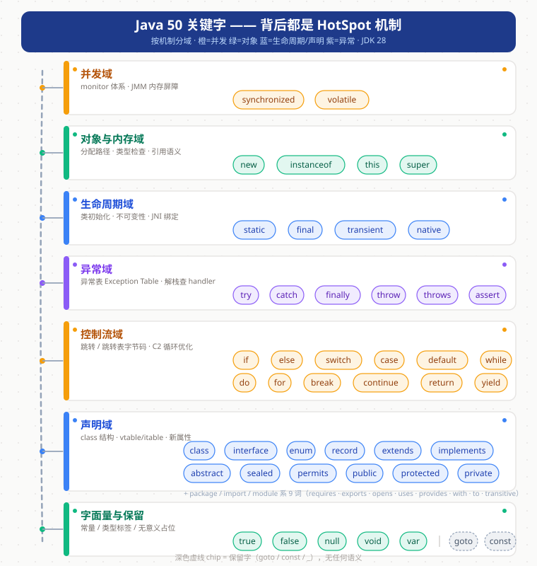

# Java 关键字全景：50 个关键字背后的 HotSpot 机制

> 版本：JDK 28 主线（`D:\project\jdk`，`28-internal`）
> 系列：Java 关键字源码跟读 · 第 01 篇（[回到系列索引](README.md)）

---

## 快速概览

- **一句话结论**：JLS §3.9 定义 Java 有 **50 个关键字**，但它们绝不是"语法标签"——**每个关键字背后要么是一条 HotSpot 机制线索，要么是 javac 消化掉的编译期语义**。`synchronized` 后面是整个 monitor 体系，`volatile` 后面是 JMM 内存屏障，`new` 后面是 TLAB 分配，`instanceof` 后面是 Klass 子类型比较。这也是为什么读 Object 之后，**关键字才是更关键的主线**。
- **三类本质区别**（本篇核心认知）：
  1. **机制型**（约 15 个）：在 VM 里有真实实现，读 C++ 源码看它们——`synchronized / volatile / new / instanceof / static / final / native / try / catch / finally / throw / throws / switch / return / break` 等；
  2. **编译期型**（javac 消化）：`var / assert / strictfp / record / sealed / permits` 等——class 文件里没有专属痕迹，读 javac；
  3. **语义型**（语言设计层）：`package / import / extends / implements / this / super / 访问控制` 等——映射到类文件结构或链接期校验。
- **与 Object 系列的衔接**：`native`（绑定机制）、`final`（wait0 不进 vtable）、`synchronized`（wait/notify 的 monitor）已在 Object 系列摸到边，本篇把它们放回关键字坐标系。
- **深读优先级建议**：`synchronized` → `volatile` → `new` → `static` → `instanceof`（P0/P1），详见[第五节](#五深读优先级建议)。

---

## 一、关键字全景分类地图

按"背后是什么机制"而不是按语法分域，7 大域、四色标注：



> 配色约定贯穿整个系列：**橙 = 并发域，绿 = 对象/字面量域，蓝 = 生命周期/声明域，紫 = 异常域**。

## 二、关键字 → HotSpot 机制映射表（核心）

> 行号均指向本仓库源码，可在 IDEA 直接跳转核对；标 ⏳ 的锚点留待对应深读篇精确定位，不凭记忆写行号。

### 2.1 并发域（橙）

| 关键字 | 一句话语义 | 背后机制 | 源码锚点 | 状态 |
|---|---|---|---|---|
| `synchronized` | 进入/退出监视器 | `monitorenter/monitorexit` 字节码 → 解释器慢路径 → `ObjectSynchronizer` → `ObjectMonitor`（锁膨胀） | 字节码定义 `interpreter/bytecodes.hpp:238`；慢路径入口 `interpreterRuntime.cpp:783`；x86 模板 `templateTable_x86.cpp:4045`（enter）/ `4154`（exit）；锁膨胀注释 `synchronizer.cpp:545`；监视器队列 `objectMonitor.cpp:1657/2032/2060` | ✅ Object 06 已铺垫，待深读锁升级 |
| `volatile` | 可见性 + 禁止重排 | class 文件 `ACC_VOLATILE` 标志 → 运行时屏障原语 → C2 `MemBarVolatileNode` 屏障节点 | 标志解析 `classFileParser.cpp:4626`（`is_volatile = (flags & JVM_ACC_VOLATILE)`）；屏障语义 `runtime/orderAccess.hpp:116-126`（fence 定义与平台对照表）；C2 屏障节点 `opto/memnode.hpp:1376`（基类 `MemBarNode` 1227） | ⏳ 待深读（JMM 主线） |

### 2.2 对象与内存域（绿）

| 关键字 | 一句话语义 | 背后机制 | 源码锚点 | 状态 |
|---|---|---|---|---|
| `new` | 分配对象 | `_new` 字节码 → `MemAllocator`：TLAB 快速路径 → TLAB 慢路径 → 堆外分配 | TLAB 快路径 `gc/shared/threadLocalAllocBuffer.inline.hpp:38`（`allocate(size_t)`）；分配器入口 `gc/shared/memAllocator.hpp:81`（`oop allocate()`）、`:46`（TLAB fast）、`:50`（TLAB slow）、`:53`（outside TLAB） | ⏳ 待深读 |
| `instanceof` | 类型检查 | 模板解释器 → `Klass::is_subtype_of`（上溯超类链）→ C2 `gen_instanceof` 下钻为子类型检查 | 模板 `templateTable_x86.cpp:3934`；类型比较 `oops/klass.cpp:141`（`is_subclass_of`）、`oops/klass.inline.hpp:121`（`is_subtype_of`）；C2 `opto/library_call.cpp:4519` | ⏳ 待深读 |
| `this` | 当前对象引用 | 局部变量槽 0（`aload_0`）——方法参数传递约定，无专属 VM 机制 | — | 语义型，顺带讲 |
| `super` | 父类引用 | 编译器把 `super.x()` 解析为 `invokespecial` 目标——无专属 VM 机制 | — | 语义型，顺带讲 |

### 2.3 生命周期域（蓝）

| 关键字 | 一句话语义 | 背后机制 | 源码锚点 | 状态 |
|---|---|---|---|---|
| `static` | 类级成员 / 类初始化 | 首次主动使用触发 `<clinit>`，`InstanceKlass::initialize_impl` 状态机（未初始化→正在初始化→初始化完成） | 主流程 `oops/instanceKlass.cpp:1417`（`initialize_impl`，入口调用 952/963） | ⏳ 待深读 |
| `final` | 不可变 / 不可覆盖 / 不可继承 | 三副面孔：① 编译期常量 → class 文件 `ConstantValue` 属性；② final 方法 → 不进 vtable（可内联）；③ final 字段 → JIT 常量折叠 | `ConstantValue` 属性解析 `classFileParser.cpp:880`（错误校验）/ `:1273`（重复属性）/ `:6444`（跳过场景）；final 方法不进 vtable 见 `Object.wait0` 设计（`java/lang/Object.java:471` 注释） | ⏳ 部分待深读 |
| `transient` | 序列化跳过 | 纯 Java 层：`ObjectStreamClass` 扫描字段时跳过 `transient`——**无 VM 机制** | `java.base/share/classes/java/io/ObjectStreamClass.java`（深读时定位） | 编译期/Java 层 |
| `native` | 方法由非 Java 实现 | JNI 绑定：VM 静态注册表 + 标准 JNI 名字解析 | 静态注册表 `classfile/javaClasses.cpp:92-104`；名字解析规则 `runtime/nativeLookup.cpp:58-125`；注册执行 `oops/method.cpp:551` | ✅ Object 01/02 已深读 |

### 2.4 异常域（紫）

| 关键字 | 一句话语义 | 背后机制 | 源码锚点 | 状态 |
|---|---|---|---|---|
| `try` / `catch` / `finally` | 结构化异常处理 | 编译为异常表（Exception Table），VM 抛异常时查表找 handler | 数据结构 `oops/constMethod.hpp:111`（`ExceptionTableElement`）、`oops/method.hpp:998`（`ExceptionTable` 助手类）、`:293`（`exception_table_start`） | ⏳ 待深读 |
| `throw` | 主动抛异常 | `athrow` 字节码 → 解释器/C2 查异常表 → 解栈 | x86 模板 `templateTable_x86.cpp:4022` | ⏳ 待深读 |
| `throws` | 声明受检异常 | class 文件 `Exceptions` 属性（方法级受检异常表） | classFileParser 解析（深读时定位） | ⏳ 待深读 |
| `assert` | 断言 | javac 生成 `$assertionsDisabled` 静态字段 + 条件跳转——**无 VM 机制** | — | 编译期型 |

### 2.5 控制流域（橙）

| 关键字 | 一句话语义 | 背后机制 | 源码锚点 | 状态 |
|---|---|---|---|---|
| `if` / `else` | 条件分支 | 条件跳转字节码（`if_icmpne` 等） | 字节码定义 `interpreter/bytecodes.hpp`（深读定位） | 顺带讲 |
| `switch` / `case` / `default` | 多路分支 | `tableswitch` / `lookupswitch` 字节码；C2 下钻为跳转表 | 字节码定义 `bytecodes.hpp`（深读定位） | ⏳ 可深读 |
| `while` / `do` / `for` | 循环 | 循环 = 跳转字节码 + 循环头；C2 有循环优化（剥离/展开） | 字节码定义 `bytecodes.hpp` | 顺带讲 |
| `break` / `continue` | 跳出/继续 | 就是 `goto` 字节码（带目标标签） | 字节码定义 `bytecodes.hpp` | 顺带讲 |
| `return` | 方法返回 | `*return` 字节码族（按返回类型 8 种） | 字节码定义 `bytecodes.hpp` | 顺带讲 |
| `yield` | switch 表达式产值 | JDK 14+ 语法，javac 消化为 `tableswitch` + 赋值——编译期型 | — | 编译期型 |

### 2.6 声明域（蓝）

| 关键字 | 一句话语义 | 背后机制 | 源码锚点 | 状态 |
|---|---|---|---|---|
| `class` / `interface` / `enum` | 类型声明 | class 文件结构 + `InstanceKlass` 创建 | classFileParser 全流程（深读定位） | ⏳ 可深读 |
| `record` | 数据载体（JDK 16+） | 普通 class + `Record` 属性 + javac 合成方法 | classFileParser 解析（深读定位） | 编译期型为主 |
| `extends` / `implements` | 继承/实现 | 超类解析 → vtable/itable 构建（链接期） | 深读定位 | ⏳ 可深读 |
| `abstract` | 抽象类/方法 | class 文件 `ACC_ABSTRACT` 标志 + 无 Code 属性 | 深读定位 | 语义型 |
| `sealed` / `permits` | 密封类（JDK 17+） | class 文件 `PermittedSubclasses` 属性，链接期校验子类集合 | classFileParser 解析（深读定位） | ⏳ 可深读 |
| `public` / `protected` / `private` | 访问控制 | `ACC_PUBLIC / ACC_PROTECTED / ACC_PRIVATE` 标志 → 链接期访问校验（Verifier） | 标志解析 `classFileParser.cpp:4626` 附近（flags 解析段） | 语义型 |
| `package` / `import` | 命名空间 | 纯编译期：包名拼进全限定名，class 文件里没有"包声明" | — | 语义型 |
| `module` / `requires` / `exports` / `opens` / `uses` / `provides` / `with` / `to` / `transitive` | JPMS 模块化 | `module-info.class`（`Module` 属性），`JVM_DefineModule` 注册 | 深读定位 | ⏳ 可深读 |

### 2.7 字面量与保留

| 关键字 | 一句话语义 | 背后机制 | 状态 |
|---|---|---|---|
| `true` / `false` / `null` | 字面量（JLS 不算关键字） | VM 里就是常量 `1/0` 和空引用，无机制 | 顺带讲 |
| `void` | 无返回 | JVM 类型标签 `T_VOID`，方法描述符 `()` | 顺带讲 |
| `var` | 局部变量类型推断（JDK 10+） | javac 类型推断，class 文件无痕迹——纯语法糖 | 编译期型 |
| `goto` / `const` | 保留字（从未使用） | JLS 保留但禁用，无任何语义 | 无意义 |
| `_` | 保留（JDK 9+） | 禁止作为标识符，无语义 | 无意义 |
| 基本类型 8 个 | `boolean/byte/char/short/int/long/float/double` | JVM 基本类型标签（`T_BOOLEAN` 等）+ 基本类型 mirror | 顺带讲 |

> **注**：JLS 的 50 个关键字严格指 §3.9 列出的列表（不含 `true/false/null`，它们是字面量；不含 `var/record/yield/sealed/permits`，它们以受限关键字身份进 JLS 其他小节）。本系列按"阅读价值"收录，不纠结 JLS 归类口径，见[附录](#附-jls-39-的-50-个关键字完整清单)。

## 三、三类关键字的本质区别

这是本篇最重要的认知框架——**知道一个关键字该去读谁**：

| 类别 | 特征 | 该读哪里 | 代表 |
|---|---|---|---|
| **机制型** | class 文件/VM 里有真实落点，有 C++ 实现 | HotSpot `src/hotspot` | `synchronized`、`volatile`、`new`、`instanceof`、`static`、`native`、`try/catch` |
| **编译期型** | javac 完全消化，class 文件无专属痕迹 | javac 源码（`src/jdk.compiler`） | `var`、`assert`、`strictfp`、`yield`、`record` 的语法糖部分 |
| **语义型** | 语言设计层语义，映射到类文件结构/链接校验 | JLS + classFileParser | `extends`、`implements`、访问控制、`package`、`import` |

判断方法很简单：**在 class 文件里搜不搜得到痕迹**。
- `synchronized` → 字节码 `monitorenter`（搜得到，机制型）
- `var` → 编译完类型全在描述符里（搜不到，编译期型）
- `private` → `ACC_PRIVATE` 标志（搜得到，但只是标志位，语义型）

## 四、与 Object 系列的衔接

关键字主线与 Object 主线在 5 个点交汇，读起来可以互相印证：

| 交汇点 | Object 系列已读 | 关键字主线延伸 |
|---|---|---|
| `native` | 绑定机制（`javaClasses.cpp:92-104` 静态注册 vs JNI 名字解析） | JNI 完整名字解析规则（`nativeLookup.cpp:58-125`） |
| `synchronized` | wait/notify 的锁膨胀（`synchronizer.cpp:545`） | 锁升级全链路：fast-locked → inflated（monitorenter 入口） |
| `final` | `wait0` private final 不进 vtable（Object.java:471） | final 三面孔：常量折叠 / 方法内联 / 字段语义 |
| `instanceof` | getClass 的 Java mirror 双身份（`klass.inline.hpp:96-98`） | `is_subtype_of` 上溯超类链（`klass.cpp:141`） |
| `new` | clone 的分配+拷贝（`jvm.cpp:891-902`） | 日常 `new` 的 TLAB 快路径（`threadLocalAllocBuffer.inline.hpp:38`） |

## 五、深读优先级建议

按"机制重量 × 与日常编码相关性"排序，建议按此顺序出深读篇：

| 优先级 | 关键字 | 深读主题 | 预估锚点域 |
|---|---|---|---|
| **P0** | `synchronized` | 锁升级全链路（fast-locked → 膨胀 → ObjectMonitor 队列），衔接 Object 06 | `synchronizer.cpp` + `objectMonitor.cpp` + `templateTable_x86.cpp` |
| **P0** | `volatile` | JMM 内存屏障、C2 MemBar 插入规则、x86 实际生成的指令 | `orderAccess.hpp` + `memnode.hpp` + `library_call.cpp` |
| **P1** | `new` | TLAB 快路径 → 慢路径 → 堆外分配，`-XX:+UseTLAB` 实验 | `threadLocalAllocBuffer.*` + `memAllocator.*` |
| **P1** | `static` | `<clinit>` 状态机、`initialize_impl` 六步、类初始化死锁 | `instanceKlass.cpp` |
| **P1** | `instanceof` | 子类型检查、C2 优化（profiled 类型）、`checkcast` 对比 | `klass.*` + `templateTable_x86.cpp` |
| **P2** | `try/catch/finally` | 异常表结构、handler 查找、finally 的复制语义 | `constMethod.hpp` + `exceptionTable` |
| **P2** | `final` | ConstantValue 属性、JIT 常量折叠、final 字段在 JMM 的语义 | `classFileParser.cpp` + C2 type 系统 |
| **P3** | `record` / `sealed` / `module` | class 文件新属性解析 | `classFileParser.cpp` |

## 六、附录：JLS §3.9 的 50 个关键字完整清单

```
abstract     assert       boolean      break        byte
case         catch        char         class        const
continue     default      do           double       else
enum         extends      final        finally      float
for          goto         if           implements   import
instanceof   int          interface    long         native
new          package      private      protected    public
return       short        static       strictfp     super
switch       synchronized this         throw        throws
transient    try          void         volatile     while
```

> 另：`true / false / null` 是字面量；`var`（JDK 10+）、`yield`（JDK 16+）、`record / sealed / permits`（JDK 16/17）、`module` 及模块相关词是上下文/受限关键字；`_` 自 JDK 9 起保留。
