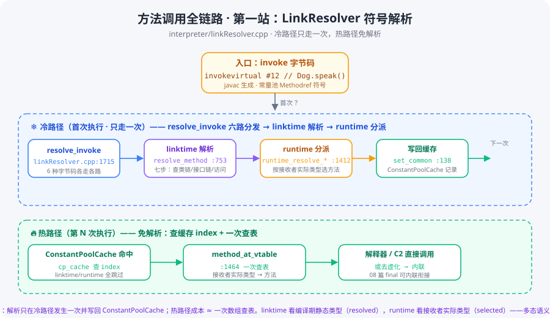

# 方法调用全链路 · 第一站：LinkResolver 符号解析

> 版本：JDK 28 主线（`D:\project\jdk`，`28-internal`）
> 系列：Java 方法调用源码跟读 · 第 01 篇（[回到系列索引](README.md)）
> 核心文件：`src/hotspot/share/interpreter/linkResolver.cpp`（+ `oops/constantPool.cpp`）

---

## 快速概览

- **一句话结论**：`invoke*` 字节码（`invokevirtual / invokespecial / invokestatic / invokeinterface / invokehandle / invokedynamic`）执行前，JVM 都要先做一次"**符号 → 真方法**"的解析，这个解析只在**冷路径**发生一次，结果写回 **ConstantPoolCache**，之后热路径免解析、成本几乎为零。
- **两个阶段的分界**（本篇核心认知）：
  1. **linktime（链接期解析）**：看**编译期静态类型**（`resolved_klass`）——在类/接口链上找到"该调用字面上指向谁"，产出 `resolved_method`，顺带做完错误分类（ICCE / NoSuchMethodError / IllegalAccessError / loader 约束）；
  2. **runtime（运行期解析）**：看**接收者实际类型**（`recv_klass`）——按 vtable/itable 索引选出"真正该执行谁"，产出 `selected_method`，**多态语义在这里落点**。
- **入口纯分发器**：`resolve_invoke`（linkResolver.cpp:1715）不做任何解析，只按字节码类型把活儿分给 6 条独立管线，互不串门。
- **懒加载的根因**：`LinkInfo` 构造时（:259）第一次触碰常量池 `klass_ref_at` → `klass_at_impl`（constantPool.cpp:631）→ `SystemDictionary::resolve_or_fail`，**调用方法的那一刻才加载类**——这就是"引用一个类不报错、调用不存在的方法才 NoSuchMethodError"的机制来源。
- **与关键字系列衔接**：08 篇的 `final 方法可内联`（`CallInfo::set_virtual` 判成 `direct_call`）、06 篇的 `itable`（`runtime_resolve_interface_method` 三分支）、09 篇的 `TosState`（解释器调用栈）——全部在这条链上汇合。

---

## 一、全景：一条调用链的四道关卡



> 冷路径（蓝）只走一次：**分发 → linktime 解析 → runtime 分派 → 写回缓存**；热路径（绿）每次执行：**查缓存 index + 一次查表**。图内行号均指向本仓库源码，可在 IDEA 直接跳转核对。

| 关卡 | 函数 | 行号 | 作用 |
|---|---|---|---|
| 入口分发 | `resolve_invoke` | :1715 | 按字节码类型分发给 6 条管线 |
| linktime 解析 | `resolve_method` | :753 | 七步：类链/接口链查找 + 错误分类 |
| runtime 分派 | `runtime_resolve_virtual_method` | :1412 | 按接收者实际类型选方法 |
| runtime 分派（接口） | `runtime_resolve_interface_method` | :1525 | 接口三分支：vtable / itable / 非虚 |
| 写回缓存 | `CallInfo::set_common` | :138 | 结果落进 ConstantPoolCache |

## 二、resolve_invoke：6 种字节码的分发器（:1715）

```cpp
void LinkResolver::resolve_invoke(CallInfo& result, Handle recv, const constantPoolHandle& pool,
                                  int index, Bytecodes::Code byte, ClassInitMode init_mode, TRAPS) {
  switch (byte) {
    case Bytecodes::_invokestatic   : resolve_invokestatic   (result,       pool, index, init_mode, CHECK); break;
    case Bytecodes::_invokespecial  : resolve_invokespecial  (result, recv, pool, index,            CHECK); break;
    case Bytecodes::_invokevirtual  : resolve_invokevirtual  (result, recv, pool, index,            CHECK); break;
    case Bytecodes::_invokehandle   : resolve_invokehandle   (result,       pool, index,            CHECK); break;
    case Bytecodes::_invokedynamic  : resolve_invokedynamic  (result,       pool, index,            CHECK); break;
    case Bytecodes::_invokeinterface: resolve_invokeinterface(result, recv, pool, index,            CHECK); break;
    default                         :                                                                       break;
  }
  return;
}
```

- **6 条独立管线**：static / special / virtual / interface / handle / indy 各走各的解析函数——语义不同（静态、构造/super/private、多态、接口分派、方法句柄、动态语言）分得清清楚楚。
- **`CHECK` 宏**：任一解析抛异常就立即返回，`result` 不落值，异常由调用方（解释器/C2）接管。
- **注意**：这个入口本身**不做任何查找**，真正的符号解析在 `resolve_method`（:753）。

## 三、懒加载：LinkInfo 与常量池解析（:259 → constantPool.cpp:631）

每条解析管线第一件事都是构造 `LinkInfo`——它把"常量池第几个槽"翻译成"类名 + 方法名 + 签名"，翻译过程会**首次触发类加载**：

```
LinkInfo 构造（linkResolver.cpp:259）
  └─> pool->klass_ref_at(index)          // constantPool.cpp:918：Methodref → 所属类
        └─> klass_at_impl(...)            // constantPool.cpp:631
              └─> SystemDictionary::resolve_or_fail  // 类没加载 → 现在加载！
```

- **机制含义**：类加载是**惰性**的——不是引用类就加载，而是**第一次真正用到（解析到它的成员）**才加载。这也是链接期"类型安全"的第一道闸：方法引用指向的类必须能加载成功。
- **`LinkInfo` 字段**：`resolved_klass`（编译期静态类型）、`name`、`signature`、`current_klass`（引用方）、`tag`（常量池 tag，用于第 2 步校验）。

## 四、linktime 七步：符号解析的错误分类器（:753）

`resolve_method` 是整条链最核心的解析器，七步每步一个异常类型，**异常类型 = 错误原因**：

| 步 | 检查 | 行号 | 失败抛什么 |
|---|---|---|---|
| ① | `invokevirtual` 调接口方法（应为类） | :760 | `IncompatibleClassChangeError` |
| ② | 常量池 tag 不是 Methodref | :769 | `IncompatibleClassChangeError` |
| ③ | 沿**类链**查找 `lookup_method_in_klasses` | :779 / :356 | —（找不到继续） |
| ④ | 沿**接口链**查找 + JSR292 签名多态 | :783 / :787 | —（找不到继续） |
| ⑤ | 方法完全不存在 | :803 | `NoSuchMethodError` |
| ⑥ | 访问检查 `check_method_accessability` | :813 | `IllegalAccessError` |
| ⑦ | loader 约束 `check_method_loader_constraints` | :821 | `LinkageError` 族 |

**③ 的细节**（`lookup_method_in_klasses` :356）：

```cpp
// Ignore overpasses so statics can be found during resolution
Method* result = klass->uncached_lookup_method(name, signature, Klass::OverpassLookupMode::skip);
...
if (result == nullptr) {
  result = ik->find_method(name, signature);          // 本类精确查找
}
if (result == nullptr) {
  Array<Method*>* default_methods = ik->default_methods();
  if (default_methods != nullptr) {
    result = InstanceKlass::find_method(default_methods, name, signature);  // 接口 default 方法
  }
}
```

- **skip overpass**：overpass（桥接方法）先跳过，保证静态方法能优先被找到（:365 注释明说）。
- **查找顺序**：本类 → 超类链（`uncached_lookup_method` 内部上溯）→ default 方法表。**注意这里不查接口**——接口是第 ④ 步单独查的。

## 五、runtime 分派：多态的落点（:1412 / :1525）

linktime 找到了"字面上指向谁"（`resolved_method`），runtime 要回答"实际该执行谁"（`selected_method`）。

### 5.1 virtual：`runtime_resolve_virtual_method`（:1412）

```cpp
// 1. 接收者为 null → NPE（:1429）
if (check_null_and_abstract && recv.is_null()) {
  THROW(vmSymbols::java_lang_NullPointerException());
}

// 2. 解析出来是接口方法（default/miranda）→ 转成 vtable index（:1440）
if (resolved_method->method_holder()->is_interface()) {
  vtable_index = vtable_index_of_interface_method(resolved_klass, resolved_method);
  selected_method = methodHandle(THREAD, recv_klass->method_at_vtable(vtable_index));
} else {
  // 3. 普通类方法 → 直接拿 vtable_index（:1450）
  vtable_index = resolved_method->vtable_index();
  // 4. final/private → nonvirtual_vtable_index → 静态绑定（:1457）
  if (vtable_index == Method::nonvirtual_vtable_index) {
    selected_method = resolved_method;              // 目标唯一，不可被覆写
  } else {
    selected_method = methodHandle(THREAD, recv_klass->method_at_vtable(vtable_index));  // :1464
  }
}
```

- **:1457 的注释直接衔接 08 篇**："final methods are never put in the vtable, unless they override an existing method"——final 方法不进 vtable，所以拿到 `nonvirtual_vtable_index` 时 `selected_method = resolved_method`（唯一目标），`CallInfo::set_virtual` 判成 `direct_call`，C2 才敢内联。
- **:1464 是整条链的高潮**：`recv_klass->method_at_vtable(vtable_index)`——**按接收者实际类型查表**，子类覆写同一槽位，这就是多态。

### 5.2 interface：`runtime_resolve_interface_method`（:1525）

```cpp
// 1. 接收者必须实现了该接口，否则 ICCE（:1540）
if (!recv_klass->is_subtype_of(resolved_klass)) {
  THROW_MSG(vmSymbols::java_lang_IncompatibleClassChangeError(), ...);
}
// 2. 在接收者类里找实例方法（skip private，:1561）
Method* method = lookup_instance_method_in_klasses(recv_klass, ...);
// 3. 非 public → IllegalAccessError（:1580）
if (!selected_method->is_public()) { THROW_MSG(vmSymbols::java_lang_IllegalAccessError(), ...); }

// 4. 三分支（:1599-1617）：
if (resolved_method->has_vtable_index()) {        // default/miranda → vtable
  result.set_virtual(resolved_klass, resolved_method, selected_method, vtable_index, CHECK);
} else if (resolved_method->has_itable_index()) { // 普通接口方法 → itable（06 篇）
  result.set_interface(resolved_klass, resolved_method, selected_method, itable_index, CHECK);
} else {                                          // final/private → 非虚
  result.set_virtual(resolved_klass, resolved_method, resolved_method, index, CHECK);
}
```

- **ICCE 的另一出处**：接口调用时接收者没实现接口，同样抛 `IncompatibleClassChangeError`——和 08 篇 final class 的 ICCE（classFileParser.cpp:6326）同族。
- **itable 的出处**：这就是 06 动画里 itable 查表的运行时来源。

## 六、写回缓存：CallInfo 与 ConstantPoolCache（:93 / :138）

runtime 解析完成后，`CallInfo` 记录结论，然后**写回 ConstantPoolCache**，热路径免解析：

```cpp
void CallInfo::set_virtual(Klass* resolved_klass, const methodHandle& resolved_method,
                           const methodHandle& selected_method, int vtable_index, TRAPS) {
  CallKind kind = (vtable_index >= 0 && !resolved_method->can_be_statically_bound()
                        ? CallInfo::vtable_call : CallInfo::direct_call);   // :99 关键判断
  set_common(resolved_klass, resolved_method, selected_method, kind, vtable_index, CHECK);
}
```

```cpp
void CallInfo::set_common(Klass* resolved_klass, ...) {                     // :138
  _resolved_klass  = resolved_klass;
  _resolved_method = resolved_method;
  _selected_method = selected_method;
  _call_kind       = kind;
  _call_index      = index;
  ...
  if (selected_method.not_null()) {
    CompilationPolicy::compile_if_required(selected_method, THREAD);        // :156 顺带触发编译
  }
}
```

- **:99 是"final 可内联"的源头**：`vtable_index >= 0` 且**不能被静态绑定** → `vtable_call`（每次查表）；否则 → `direct_call`（目标唯一，C2 可内联）。`can_be_statically_bound()` 为真的正是 final/private 方法。
- **:156 的彩蛋**：解析顺带调 `CompilationPolicy::compile_if_required`——**热方法在解析时就开始排队 JIT 编译了**。

## 七、冷路径 vs 热路径对比

| 维度 | 冷路径（首次） | 热路径（第 N 次） |
|---|---|---|
| 入口 | `resolve_invoke`（:1715） | ConstantPoolCache 查 index |
| 类加载 | 可能触发 `SystemDictionary::resolve_or_fail` | 无 |
| 符号解析 | `resolve_method` 七步 + runtime 三分支 | 无 |
| 查找成本 | 类链/接口链遍历 + 访问校验 | `method_at_vtable` 一次数组查表 |
| 写回 | `set_common` → ConstantPoolCache | 无 |
| 触发 JIT | `compile_if_required`（:156） | 无 |

## 八、与系列衔接 + 下一站

| 前文埋点 | 本篇兑现 |
|---|---|
| 08 篇 `final 方法可内联`（ciMethod.hpp:353） | `nonvirtual_vtable_index` → `direct_call`（:99/:1457） |
| 06 篇 `itable`（instanceof 类型检查） | `set_interface` 三分支（:1607） |
| 09 篇 `TosState`（解释器栈） | 解释器 invoke 模板查 CPCache → 按 `_call_kind` 分派 |
| 05 篇 `<clinit>`（static 字段） | `resolve_invokestatic` 带 `ClassInitMode`（:1717）触发类初始化 |

**下一站**：`oops/klassVtable.cpp` —— vtable/itable 在**链接期怎么构建**（槽位分配、覆写合并、final 方法不进表）、运行期 `method_at_vtable` / itable 查表的**线性扫描 vs 表驱动**，正好接上本篇的 `vtable_index` 与 `itable_index`。

> 待办（⏳）：解释器侧 `templateTable_x86.cpp` 的 invoke 模板（CPCache 怎么查、`_call_kind` 怎么用）、C2 侧 `opto/doCall.cpp` 的去虚化与内联决策——留待后续篇章定位精确行号后补写，不凭记忆占位。
